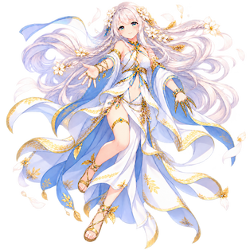
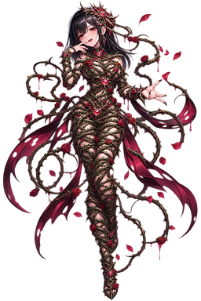
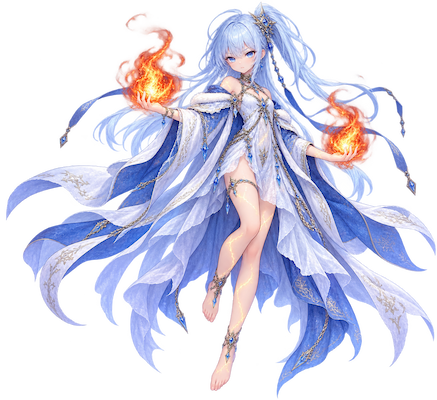
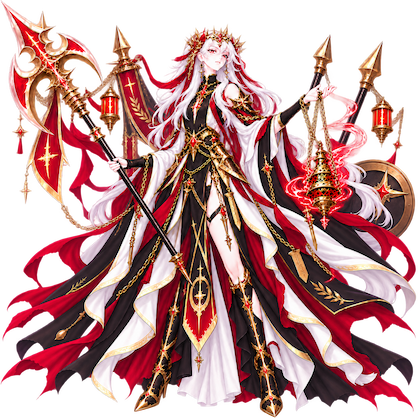
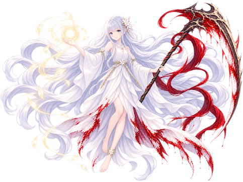
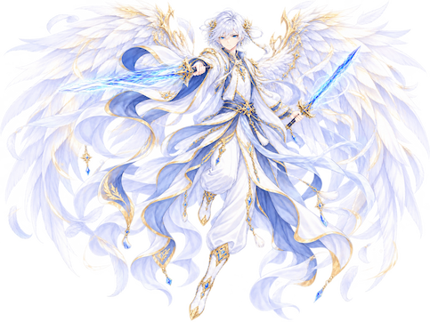
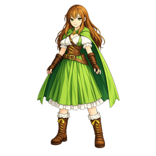

# Lore

* 暁の鳥
あちこちで徒党を組んで悪さをしているチンピラの集まり。
何の因果かマサがこの集団のリーダー格になっていたが、それである程度まとまっていたというのだから、構成員の内容も程度が知れるというものである。
物語開始時点でマサ含め結構な数の構成員が既に捕縛されており、再教育センター送りにされている。
活動拠点が異空間にまで広がっていることが後々発覚することとなり、裏でこの組織を支援する何者かの存在が疑われている。

* ロール（役割）
烙印とも。
この世界に転移してくるものはすべて何らかの「素質」を持っており、この世界に適応する形でその素質に関連する能力が大幅に強化される。
しかし、現在のストーリーの主世界は至って平穏な地域が多くを占めており、世界が危機に瀕しているとか勇者を求めているとかそんな不穏すぎる状況にはなく、誰が何のためにこのようなことを引き起こしているのかは現時点では謎である。

* 到達者
この世界に迷い込んでしまった不運な人々のうち、なんらかの才能を無意識のうちに開花させた人々の総称。現実世界において、もともと秀でていた能力や特技などの技能がまるで以前からそうであったかのように超強化され、自在に行使できるようになると言われている。ただし、そうならない人間もおり、その場合は「一般人」となんらかわらない存在となる。

**【真実】**
サトシの日ごろの妄想が次元の魔力を励起させ、長きにわたり形成された妄想の世界。
だが、サトシはあまりにも日常的にそういうことを妄想しすぎているため、その真実に全く気が付いていない。
サトシの心ひとつで世界をどうにかできるということに最後まで気が付かない。
何故なら、彼は不眠不休でそのようななろう小説を書いており、そしてその主人公と同じ道を歩んでいるが、まさか自分にそんな事が起ころうことなど想定もしないからである。
そう、彼は現実はよくみる性格だったのである。
（だから妄想にふけり、現実から目を背ける）
その世界はまるで数千年前から存在していたかのように歴史があり、神々が存在し、魑魅魍魎が跋扈する世界ではあるが、バランスは保たれており人々はたくましく生活している。
だが、その歴史を紐解いてみるとそこには白紙のページのみが描かれており、その事を気に留める者はいない。
しかし、神々だけはその状況を把握している。
彼らは次元の塔を通じてすべての次元へ自由自在にアクセスできる超越的存在であるが、今まで存在しなかった次元と世界が突然出現し、さも以前から神々を認識していたかのように崇敬されている異常事態に戸惑いすらしている状況である。
しかし、その未知数の信仰心は神々にとっても非常に魅力的であったため、姿かたちを変え世界へ干渉することでそこにいる存在へ更なる接触を図り、このフロンティアでの新たなる信仰の力を集めようともくろんでいる。

## 世界の根幹

### 世界の起源
サトシたちが学生として生活する世界は我々が今を過ごしている地球と全く同一の世界である。
その起源は我々の歴史と共有し宇宙の由来もまた同じであるが、彼らの宇宙は多次元にわたり遍く存在し、薄い次元の壁を隔てて別の宇宙が広がっている。   
別の宇宙では我々の常識や法則が通用しない超常的な力が存在しており、それらがなんらかの理由で発生する次元の揺らぎにより異世界から漏出し、予期せぬ事態を引き起こすといったことが稀に発生している（所謂「魔力」もこれの一部である）
普段はこれらの力は安定しており、人ひとりの力で揺らぎを発生させられるほど脆弱というわけでもないため、何かあっても地球でいうところの台風レベルの自然災害としてしか扱われていない。
ただし、それはあちら側の世界の話であって、こちら側の世界でそういったことが起きれば話は別である。
HideyosuRPG１作目はこちら側の世界であちら側の世界の現象が偶然とは思えない頻度で発生し、現実世界に深刻な影響を与えたことで彼ら（マサ・サトシら）の受難の物語へと分岐することになった。

### 神々の起源
神々の起源を知るには、物質の起源、魔力の起源、果ては宇宙の起源から次元の起源へ遡る必要があるが、残念ながらそれらすべてを紐解くことは現時点では不可能である。
だが、現在において分かっていることのみを述べるとすれば、魔力はダークマターのように無の空間に遍く存在しているエネルギー流の一種である。
このエネルギー流はあらゆる生命体の意思に感応し、特性に応じて様々な超常現象を引き起こすことが可能になる。
そして、神々はそのエネルギーが何らかの理由で意思を持ち、その意思が具現化することで魔力世界に顕現したと考えられている。

### 妖術
魔法とは違い、自身や身に着けてる装備が纏う妖気を練り上げ、変性させて相手にぶつける東洋魔術である。
魔力線の存在しない地球でも使用可能で、特に日本の妖怪は生身でこれらの力を行使することができる。
現代に生きる妖怪である座敷童も、だいぶ妖気は薄れたとは言えどしっかり練り上げれば強力な力を発現させることは可能である。
妖気を操るには、まず自身の妖気の存在を把握し、練り上げて性質を与えることを覚えなければならないが、通常の人間では妖気を認識することはまず不可能。
霊感が強い人間や、何らかの方法で妖気を観測する妖具を取得できた人間だけがこれを認識することができ、そしてそれを操る術を知ることができる。
また、力の性質が違うため異世界の大魔法使いをもってしても生身では妖気を認識することはできない。

### 魔法
精神を統一し、詠唱を通して偉大なる魔力の流れへ自身の意識を接続し、そこからエネルギーを抽出して現世に現象を発現させる。
しかし、この一連の動作は人間ではいかなる鍛錬を積もうともそう簡単に会得できるシロモノではなかった。
そのため、たとえ小さな炎や風を起こす魔法を唱えるにしても何らかの「触媒」を体内に取り込み精神そのものに"流れ"をもたらすことで魔力親和性を高めるといったことをしている。
触媒は魔力を使用して何を行使したいかで必要なものが変わってくるが、魔力性クリスタルの粉や生の目玉、薬草を乾燥させて煙にしたものや空気そのものなどがよく使われている。
通常であれば触媒は多量に摂取する必要はないため、魔法を行使している人間は腰袋に少量の触媒を携えていることが普通で、道すがら採取と精製をするだけで事足りる場合がほとんどである。
触媒の純度と量を高めれば高めるほどに大魔法を扱えるようになるが、あんまりやりすぎると依存症になったり精神すり減らしすぎて鬱になってしまうため、高度な鍛錬を積み続ける必要がある。
そのため、大魔法を高度に扱える存在は、人間をやめてしまった者やそもそも人間ではなかったりする場合がほとんどで、力に取り込まれてしまう事例が後を絶たず、数々の大事件を引き起こすなど歴史に名前を残すモノも少なくない。

※メタ的な話をすれば、MPは精神崩壊を防ぐために働く本能的なリミッターであり、それを超えると人間に戻れなくなってしまうなど多大な悪影響を詠唱者に及ぼしてしまう。

なお、身体的に妖術の素質がある生物は魔法の会得は比較的容易となる。
妖術行使と体系が類似していることと、妖気を触媒代わりにして魔力界とのチャネリングが可能となるためである。
座敷童は現代の西洋魔術の体系から魔法行使の基礎理論を独自に構築し、妖気を器として魔力を自らに注入して魔法として発動させている。

### 呪文
真言ともいう。呪術的な儀式をもって神々の加護を引き出し、その力を行使するための一連の手続きの一種である。
手続きさえこなせば発動できるため魔法の素質が無い人間でも扱えるが、実践的なものを扱おうとすると長大な儀式や触媒が必要になることから、その場その場での発動はまず現実的ではない。
しかし、予めスクロールなどに魔方陣などを書き写して携行しておくことで、簡易的な儀式を行うことは可能。
大抵は必要な時にスクロールを広げて決められた呪文を唱えるだけで済むため、一般の人々が町から遠出する必要が出た際には何かあった時に備えて魔法店からいくつか購入しておくことが多い。

### エンリメットバース
純粋な魔力界に次元の裂け目が発生し、魔力の流れが乱れ縺れ合った場所に生まれた異空間、次元の狭間、または魔力界のバグ。
そこに存在する存在はすべて魔法生物であるが、裂け目から流れ込む異界の生命エネルギーの影響を受けて、魔法生物以外でも様々なものが存在している。
なお、各地に置かれているゲートは実はこの世界が魔力の裂け目が空間に現れた際に、中からその裂け目を物理的に埋めるために設置したものとされている。
魔力励起すると、その穴が強引に広げられて空間を飲み込み、そこにいた人間を引きずり込む形で転移させているというのが原理のようだ。
誰がそれを設置したかは明らかになっていないが、到達者や現地の学者などによりこの現象が研究されており、この魔力空間は複数の裂け目により生まれる魔力線の流れにより、川の流れにのるかのごとく出入り口が存在するということが明らかになっている。

### 次元の塔（ディメンションタワー）
遍く次元を貫き、すべての世界をつなぎとめる構造体。
魔力の源流とも、神々の聖遺構ともいわれているが詳細はすべて不明。見た目が人造的な構造物であることから、何者かが意思を持って建造した可能性が高いとされている。
その領域へ踏み込んだ者は、数々の試練が与えられると同時に、あらゆる世界の真理に触れることができる。
かつては別の世界に突如として現れ、一種の恐怖の象徴として禁制領域と扱われていたが、真理の先にあるものを夢見た数多くの冒険者がこの塔への侵入を試み、そして誰一人として帰還したものはいなかった。
しかし、ある日ただ一人、著名な錬金魔術師が踏破に成功し、無事地上に帰還した。
帰還したその錬金術師は、大いなる知の源流に触れることに成功したが、同時に狂気に蝕まれており、数日後に謎の失踪を遂げた。
最終的には、かの地ごと次元の狭間に飲み込まれ消滅してしまって以降、その存在が確認された例はすべての次元において皆無である。

## God's lore
神々の伝承はあまり広くは伝えられておらず、伝承の小部屋でのみその一遍をうかがい知ることができる。
なお、世界の根源にアクセスできる唯一にして無空の存在だが、その存在はその次元の塔を超えることはできない。
別次元へ干渉することは可能ではあるが、あくまで閉じられた世界の創造された存在には変わらない点は注意が必要。
神々から賜るアーティファクトは非常にユニークな力を持っているとされる。  
なお、イメージはすべてAIが生成した空想のイメージであり、実際の姿は見る者によって変わるとされる。
### Mitoya the "Treater"
癒しを司る神。ミトヤ。  

信仰者には癒しの手を差し伸べあらゆる怪我や病気を治癒してくれる。
穢れた魂を浄化し清浄なる魂へ、穢れた大地を浄化し聖なる土地へと導く神。
だが、その浄化手法は結構適当なことがあり、例えば穢れた土地を浄化するのに大量の塩を撒くように信託を下すなどなかなかにひどい。というか、勝手に大地の神「ヴェクト」の領域へ踏み込んで勝手に大地浄化の名目のもと塩をばらまかせている。当然ヴェクトとは仲が悪い。
癒しの手だけは本物であるだけに、一般の人々からはそれなりに信仰を集めている。
その実、争いごとが大好きで小競り合いでより多くの生き血を流させるためには手段を選ばないことも多く、信者にはよくないことを吹き込んだりするなどは日常茶飯事。厄介ごとを持ち込む根源としてゲオールからも特に嫌われている。
当然のようにKeptolに浄化した魂を売り渡したりもする。
もちろんマッチポンプも得意であり、異形の左手はその力をいかんなく発揮することができる。
今のところ、所在地は不明。

**アーティファクト：トリーターアミュレット**
別名癒しの石の護符。
これを身に着けた者に強力なリジェネ効果の加護を与える。
また、高コストだが強力な回復魔法の知識も与える。
### Eefa the "Lover"
愛を司る神。イーファ。  

性別を入れ替えたり魂を入れ替えたりして人々の愛を試すとんでもない趣味をお持ちの女神。
しかし特定の層に限り熱狂的な信者がおり、信仰は厚い。
天罰として気まぐれで男に妊娠させたり、異形を妊娠させて腹を食い破らせたりしている。
供物に新生児の脳入り頭蓋骨を要求するなど結構グルメな一面もある。
とんでもない被虐・加虐趣味をもっており、神々の中で最も変人。
豊穣の地の植物を勝手に鋭い棘の薔薇に置き換えたりしており、ヴェクトからは大変に嫌われている。
今のところ、所在地は不明。

**アーティファクト：愛の鞭**
別名いばらの鞭。いばらのようなトゲトゲがついてるが、実際は鎖に有刺鉄線を括り付けた凶器。当然先端にはモルゲンステルンのような棘付きのハート型鉄球がついており、生身であろうと重装であろうと容赦なく粉砕できる性能を誇る。

**アーティファクト：薔薇のローブ**
別名愛の薔薇。薔薇を象ったローブ・・・ではなく、鋭い棘の生えたツタをただ単純に体にグルグル巻きにするだけというトンチキ衣装。イーファ自身が好んで身に着けている。複数のマジッククォーツが使用者に共鳴し魔力を発生させ、自己成長・進化を行うことから見た目とは裏腹に非常に高性能な装備と言える。なお、少しでも動けば棘は装着者の肌に刺さるため行動するたびにダメージを受けるが、その痛みのおかげで各種精神異常から完全に身を守ることができる。
### Gerla the "Element"
元素を司る神。ゲルァー。  

他の神とはなぜか非常に仲が悪い。
炎・冷気・雷の三大元素を司ってはいるが、炎が特にお好みのようで、崇拝の儀式に挑む信者に高温の炎を叩きつけて燃やし戯れている。ただ、炭にされる信者はとても喜んでいるようなので特に問題はないようだ。焼かれた者の肉はそのまま料理として調理され、赤い葡萄酒とあわせて供物として奉納されたのち、信者に振舞われる。  
さすがに傍から見たら頭がどうかしてるようにしか見えない儀式のためあまり信仰はされていないが、盗賊一味などどうにもネジが吹っ飛んでる連中にとっては人気があるようで、隠れ家に祭壇を設ける悪党も多い。また、一般人のふりをした隠れ信者も多い。
今のところ、所在地は不明であるが、もっとも熱狂的な信者が集まる地方では、首長が怪しい料理を旅人にも振舞っているとか・・・。

**アーティファクト：エレメントシールド**
別名元素の盾。
３元素に高い抵抗を持つ有用なアーティファクト。
相反する属性を簡単に繰り出してくるこの世界では喉から手が出るほど欲しい逸品。実はイージスの盾という人間製のライバル盾があるが、あちらは騎士盾で重たい。こちらはマジック製で軽量のため誰でも扱うことができるという特徴がある。防御力は並だが、魔法防御力もある。
### Georl the "War"
争いごとを司る神。ゲオール。  

気分で大小限らず争いごとの結末を采配する、当事者からすればとんでもなく迷惑な存在だが、否応なしに紛争に巻き込まれている民にとってはある意味ありがたい神であり、日常的な崇拝対象として以外と身近な存在となっている。
例え信者でなくとも、日常のちょっとした諍いなどについてちょっとしたお供えと祈りをささげることでで解決してあげるなど、身近なトラブルバスターとして人々との関係は良好。
神々の中でも最も怠惰であり、他の神とは仲が悪い。
祀りごとの際には、男女カップルを祭壇に立たせ、片方の男の頬をもう片方の女がお気に入りのナックルダスターで1発だけ思いっきり殴りつけるという儀式があり、ゲオールはこれをとても気に入っている。その儀式において、殴られ役の男が一度だけ顔がもげて死にかけたことがあったが、この時ゲオールは大層喜び、最大級の褒美を女に与えたという。男はその後ケプトルの世話になった。
とある教会の地下にはゲオール崇拝の本拠地があり、神域の間において選ばれし者のみが神に謁見することを許されている。

**アーティファクト：ゲオール=ラス=ヴェル**
別名硬くて重たい槌。
アダマント製の巨大なハンマーでどんな相手も装甲ごとぺったんこにしてしまう凶器。
普通の人間ではとても扱えない。
### Keptol the "Death"
死を司る神。ケプトル。  

見えざる手の正体、気分で適当に生命の首を刎ねる。
１日の死亡ノルマを達成しないと神の座から降格されるという暗黙の脅迫概念により、仕方なく日々適当に死の鎌を振るっている。
とはいえ、自身で積極的に殺害をくりかえるのではなく、下界の人間から藁人形的な呪術を受信し、その都度適度に望みをかなえることで今のところ無事に生業をこなすことができている。
現世においては、北方地方にあるとある墓所にいい感じの部屋を作り、居を構えている。  
その姿はどことなくミトヤとにており、関係性が噂されるも真実は不明。ただ、魂の取引相手としてミトヤとの関係は良好である。

**アーティファクト：死のアンク**
別名不吉な呪詛。
死生観を覆す伝説のアンクは手に入れたものを不老不死にするといわれている。
実際には不老不死などはあり得ないが、即死攻撃に完全耐性を付与してくれるありがたい護符。

**アーティファクト：ゲル＝ベルナル**
別名大疫を呼ぶナイフ
未知のウイルスを創出し、刺した相手に直接送り込む非常に危険な短剣。
耐性を無視した猛毒・麻痺・混乱などの複合的なステータス異常を引き起こす。
### Keptol the "Life"
生命を司る神。  

というか、死神Keptolと同一の存在。
刈り取った魂を適当に転生させて新しい命として別世界へ横流ししている。
ただし、転生先は保証されないため、人間だったのにカマキリへ転生させられたりとこれはこれで結構ひどい。
ミトヤから譲り受けた浄化された魂を転生させて好き勝手弄んだあげく、再度肉体から取り上げて転生させたりもする。結果的にものすごく穢れた魂が出来上がるため、転生先では大抵ろくなことが起きていない。
実は生命の神は別にいたらしいがなぜKeptolが支配しているのかは・・・。

**アーティファクト：ソウルスティーラー**
別名魂を抉るダガー。
肉体に宿る魂を貫き、直接死を齎す短剣。
例え肉体に傷をつけられなくとも魂に直接攻撃ができる呪いがかけられている。

**アーティファクト：ゲヴィーラ＝ベルナル**
別名魂を刈り取る大鎌
相手の首に刃をあてるだけで魂を刈り取り首が転がり落ちるといわれている恐怖の鎌。
### **Yharlna the "BlueSky"**
自由なる空を司る神。ハルナ。  

天空から大地を見下ろし、雨を降らせ嵐を起こす。中性的な見た目とは裏腹にとんでもない悪癖を持つ災害の神。天空の恵みを地に与え、豊穣の大地を生み出すとともに、終わりなき日光を浴びせ続け大地を枯らせ不毛の大地を広げている。特に気に入らない場所は水害を起こし全てを押し流したうえで旱魃を起こし完全なる死の大地へと変えてしまうことも厭わないため、恐怖の象徴としても君臨している。
貢物の量が多く質がよいところを優先して恩恵を与えるため、貧相な土地は余計に貧相になるという悪循環をもたらしている。
当然、大地の神とはそりが合わない（そもそも力関係からしてハルナの方が上なので当然ではあるが）。
自由な大空全体が神の領域であり、特に居場所は決めていないようだ。

**アーティファクト：大空の羽衣**
別名エアーマント。
風属性を吸収し、HPを回復できる空気のように軽いマジック製繊維で編まれた薄い羽衣。
防御力は皆無だが回避力に高い補正がつく。
### Vect the "EverGreen"
豊穣なる大地を司る神。ヴェクト。  

大地の神と崇められているが、実際は海や海底なども担当の範疇。
ハルナの我がままで荒れ放題になる大地にオアシスを作るなど、いかれポンチな神々しかないこの世界では珍しい慈悲深いタイプだが、押しに弱いためハルナの好き放題を止めることができず、ダメになりそうな土地に付け焼刃的に救いの手を差し伸べるのが精いっぱいというのが現状である。
ただし、スターシアの聖地は新天地におけるヴェクトの総本山であり、何があってもここだけは死守するつもりで普段からこの地の守護に徹している。そのため他のエリアにはあまりパワーを割いていないという一面もある。（スターシア地方だけが異常なまでに穏やかなのはそれが理由）
スターシアーダに最近異世界の神の像を持ち込まれて熱心にこれを信仰する住民がいると知り、このままでは信仰心の低下ひいては自身の力の低下を招いてしまうため、心穏やかではいられない神はたまたま聖域に侵入してきた到達者を捕まえてちょっとした代行作業を依頼することになる。  
人間社会に紛れ込んで活動するため、人里に降りてくる時は神の力は全て封印している。そのため、一般女性のような見た目をしているときの力は人間のそれと大差はない。

**アーティファクト：大地の兜**
別名アースヘルム。
大地属性に耐性があり、兜の中では類まれなる防御力を誇る。
大地属性を吸収し、物理ダメージを一定割合カットする。

